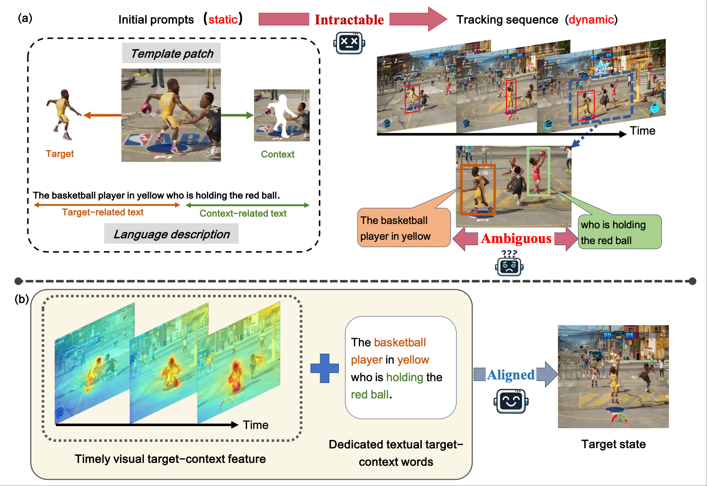
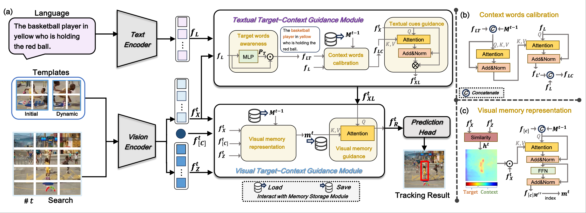
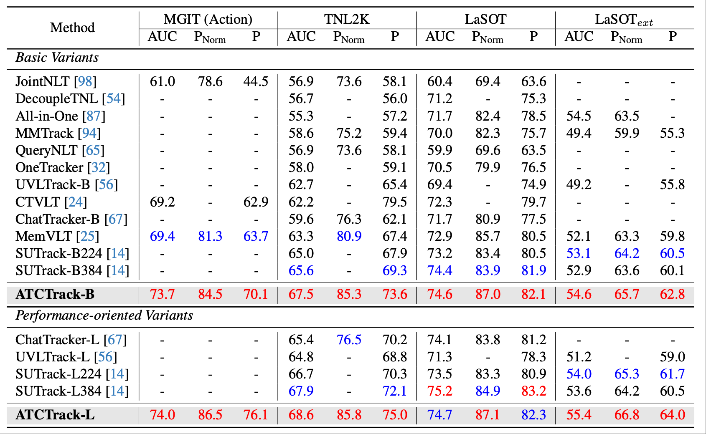

# ATCTrack: Aligning Target-Context Cues with Dynamic Target States for Robust Vision-Language Tracking

> [Xiaokun Feng](https://scholar.google.com.hk/citations?user=NqXtIPIAAAAJ),  [Shiyu Hu](https://huuuuusy.github.io/), [Xuchen Li](https://github.com/Xuchen-Li), [Dailing Zhang](https://scholar.google.com.hk/citations?user=ApH4wOcAAAAJ), [Meiqi Wu](https://scholar.google.com.hk/citations?user=fGc7NVAAAAAJ), [Jing Zhang](https://github.com/XiaokunFeng/CSTrack), [Xiaotang Chen](http://www.ia.cas.cn/rcdw/fyjy/202404/t20240422_7129814.html), [Kaiqi Huang](https://people.ucas.ac.cn/~0004554)


[](https://arxiv.org/abs/2507.19875)
[](https://huggingface.co/Xiaokunfeng2022/ATCTrack)

This is an official pytorch implementation of the paper **ATCTrack: Aligning Target-Context Cues with Dynamic Target States for Robust Vision-Language Tracking**.


### 🔥 Updates

*   \[8/2025\] **ATCTrack's** code is available!
*   \[6/2025\] **ATCTrack**  is accepted by ICCV25 Highlight!

### 📣 Overview
#### Our motivation & Core modeling approach

Vision-language tracking aims to locate the target object in the video sequence using a template patch and a language description provided in the initial frame. To achieve
robust tracking, especially in complex long-term scenarios that reflect real-world conditions as recently highlighted by
MGIT, it is essential not only to characterize the target features but also to utilize the context features related to the
target. However, the visual and textual target-context cues
derived from the initial prompts generally align only with
the initial target state. Due to their dynamic nature, target states are constantly changing, particularly in complex
long-term sequences. It is intractable for these cues to continuously guide Vision-Language Trackers (VLTs). Furthermore, for the text prompts with diverse expressions, our
experiments reveal that existing VLTs struggle to discern
which words pertain to the target or the context, complicating the utilization of textual cues. 


In this work, we present a novel tracker named ATCTrack, which can obtain multimodal cues Aligned with the dynamic target states
through comprehensive Target-Context feature modeling,
thereby achieving robust tracking. Specifically, (1) for the
visual modality, we propose an effective temporal visual
target-context modeling approach that provides the tracker
with timely visual cues. (2) For the textual modality, we
achieve precise target words identification solely based on
textual content, and design an innovative context words
calibration method to adaptively utilize auxiliary context
words. (3) We conduct extensive experiments on mainstream benchmarks and ATCTrack achieves a new SOTA
performance


#### Strong performance




### 🔨 Installation
```
conda create -n atctrack python=3.8
conda activate atctrack
bash install.sh
```

### 🔧 Usage

#### Data Preparation
Our ATCTrack is trained on  LaSOT, TNL2K, RefCOCOg, OTB99-Lang, VastTrack, GOT-10k, and TrackingNet datasets.  
Put these tracking datasets in [./data](data). It should look like:

   ```
   ${ATCTrack_ROOT}
    -- data
        -- lasot
            |-- airplane
            |-- basketball
            |-- bear
            ...
        -- got10k
            |-- test
            |-- train
            |-- val
        -- coco
            |-- annotations
            |-- images
        -- trackingnet
            |-- TRAIN_0
            |-- TRAIN_1
            ...
            |-- TRAIN_11
            |-- TEST
        -- VastTrack
            |-- unisot_train_final_backup
                |-- Aardwolf
                ...
                |-- Zither
            |-- unisot_final_test
                |-- Aardwolf
                ...
                |-- Zither
        -- tnl2k
            -- train
                |-- Arrow_Video_ZZ04_done
                |-- Assassin_video_1-Done
                |-- Assassin_video_2-Done
                ...
            -- test
                |-- advSamp_Baseball_game_002-Done
                |-- advSamp_Baseball_video_01-Done
                |-- advSamp_Baseball_video_02-Done
                ...

   ```

#### Set project paths
Run the following command to set paths for this project
```
python tracking/create_default_local_file.py --workspace_dir . --data_dir ./data --save_dir .
```
After running this command, you can also modify paths by editing these two files
```
lib/train/admin/local.py  # paths about training
lib/test/evaluation/local.py  # paths about testing
```

#### Train
##### Prepare pretrained backbone
The backbone and patch embedding of ATCTrack are initialized with pre-trained weights from [**Fast-iTPN**](https://github.com/sunsmarterjie/iTPN), and we adopt RoBERTa-Base as our text encoder.  
Please download the **fast_itpn_base_clipl_e1600.pt**, **fast_itpn_large_1600e_1k.pt** and **roberta-base** checkpoints and place them in [./resource/pretrained_models](./resource/pretrained_models).

##### Train ATCTrack
You can run the following command to train the ATCTrack-B:
```
python -m torch.distributed.launch --nproc_per_node 3 lib/train/run_training.py --script atctrack --config atctrack_base --save_dir .
```

Besides, you can run the following command to train the ATCTrack-L:
```
python -m torch.distributed.launch --nproc_per_node 3 lib/train/run_training.py --script atctrack --config atctrack_large --save_dir .
```

#### Test and evaluate on benchmarks
First, you need to set the paths for the various evaluation benchmarks in [./lib/test/evaluation/local.py](./lib/test/evaluation/local.py), and prepare the model weights for evaluation. 
Then, run the following command to perform evaluation on different benchmarks (taking atctrack_base as an example).
- LaSOT
```
python tracking/test.py --tracker_name atctrack --tracker_param atctrack_base --dataset lasot_lang --threads 4 --num_gpus 2 --ckpt_path '{your_dir_saved_model_ckpt}/ATCTrack_b.pth.tar'
python tracking/analysis_results.py --dataset_name lasot_lang --tracker_param atctrack_base
```
- LaSOT_ext
```
python tracking/test.py --tracker_name atctrack --tracker_param atctrack_base --dataset lasot_extension_subset_lang --threads 4 --num_gpus 2 --ckpt_path '{your_dir_saved_model_ckpt}/ATCTrack_b.pth.tar'
python tracking/analysis_results.py --dataset_name lasot_extension_subset_lang --tracker_param atctrack_base
```

- TNL2K
```
python tracking/test.py --tracker_name atctrack --tracker_param atctrack_base --dataset tnl2k --threads 4 --num_gpus 2 --ckpt_path '{your_dir_saved_model_ckpt}/ATCTrack_b.pth.tar'
python tracking/analysis_results.py --dataset_name lasot_extension_subset_lang --tracker_param atctrack_base
```

- MGIT

Please refer to the [official MGIT testing platform](http://videocube.aitestunion.com/) and [tools](https://github.com/huuuuusy/videocube-toolkit) to complete the corresponding evaluation.

### 📊 Model Zoo
The trained models, and the raw tracking results are provided in the [](https://huggingface.co/Xiaokunfeng2022/ATCTrack).


### ❤️Acknowledgement
We would like to express our gratitude to the following open-source repositories that our work is based on: [SeqtrackV2](https://github.com/chenxin-dlut/SeqTrackv2),  [AQATrack](https://github.com/GXNU-ZhongLab/AQATrack), [Fast-iTPN](https://github.com/sunsmarterjie/iTPN).
Their contributions have been invaluable to this project.


