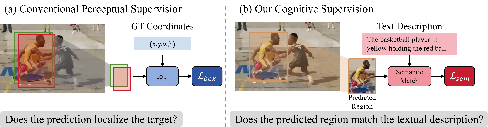

# SALT-Track

SALT-Track 是一个基于 ATCTrack 持续演化的视觉语言跟踪研究项目。当前阶段，我们关注的问题不是“如何再堆一个新的文本分支”，而是更具体的一个问题：

**文本除了作为输入条件，是否还能作为训练阶段的监督信号，去约束跟踪器学到更稳定的目标语义表示？**

我们当前的研究主线可以概括为：

- 基于 ATCTrack 已有的视觉-语言建模能力，保留其动态目标-上下文建模优势
- 不再引入额外的外部 CLIP 对齐空间
- 直接利用 ATCTrack 增强后的文本特征、预测区域特征和 GT 区域特征构造语义监督
- 将传统框监督理解为**感知监督信号**
- 将文本驱动的实例语义约束理解为**语义认知监督信号**

换句话说，我们当前的方法不是在重写 ATCTrack 的输入融合逻辑，而是在 ATCTrack 原有框监督之外，补上一条更接近“目标是否符合文本描述”的监督路径。

## 研究动机

我们最初受一篇图像恢复方向工作的启发，开始思考“语义对齐”是否也能用于视觉语言跟踪。沿着这个思路往下做之后，我们逐步形成了现在更清晰的判断：

- 在视觉语言跟踪中，文本早已不是一个陌生模态，而是主网络的一部分
- 对我们来说，真正值得研究的不是“是否引入另一个外部语义空间”
- 而是“如何让文本在训练阶段变成一个更有效、更合理的监督信号”

因此，项目当前的核心关注点转向了：

**如何在跟踪训练中，把单纯的感知监督，扩展为感知监督 + 语义认知监督的双监督框架。**

下图是当前阶段的方法动机草图：



## 当前方法表述

现阶段我们更倾向于用下面这套话语来组织方法：

- **感知监督信号**：来自边界框、IoU、L1、置信度等标准跟踪监督，回答的是“框得准不准”
- **语义认知监督信号**：来自文本语义与实例特征之间的一致性约束，回答的是“当前预测区域是不是文本描述的那个目标”

在实现上，我们当前采取的是最小闭环版本：

1. 从 ATCTrack 融合后的搜索特征图中提取预测框对应的实例特征
2. 从同一特征图中提取 GT 框对应的实例特征
3. 对 ATCTrack 增强后的文本特征做池化，得到句子级语义锚点
4. 在 ATCTrack 自身特征空间内构造辅助损失，而不是额外拉到 CLIP 空间中
5. 使用两阶段权重调度控制语义监督强度，使其既能介入训练，又不过度干扰定位主任务

## 项目现状

当前仓库主要服务于以下目标：

- 以 ATCTrack 为基础模型开展语义监督实验
- 组织正式对比实验，包括：
  - `full`：视觉监督 + 文本监督，全量微调
  - `visual`：仅保留视觉一致性监督
  - `text`：仅保留文本语义监督
  - `lora`：LoRA 微调版本
- 在 TNL2K 等基准上进行验证
- 为后续论文撰写和结构图设计积累实验依据

## 仓库结构

### 训练与模型

- `lib/models/atctrack/`：ATCTrack 主模型与当前语义监督相关实现
- `lib/train/actors/atctrack.py`：训练时的前向与损失计算逻辑
- `lib/train/data/`：采样与数据处理
- `lib/train/dataset/`：LaSOT、TNL2K、OTB99、VastTrack 等数据集读取
- `lib/train/run_training.py`：正式训练入口

### 实验配置

- `experiments/atctrack/atctrack_base_semantic_full.yaml`
- `experiments/atctrack/atctrack_base_semantic_visual.yaml`
- `experiments/atctrack/atctrack_base_semantic_text.yaml`
- `experiments/atctrack/atctrack_base_semantic_lora.yaml`

### 测试与分析

- `tracking/test.py`：推理入口
- `tracking/analysis_results.py`：指标统计入口
- `scripts/cmd.md`：当前整理后的训练、推理与分析命令

## 环境与依赖

建议使用当前实验环境：

```bash
conda create -n atctrack python=3.10
conda activate atctrack
bash install.sh
```

如果你已经在现有机器上复现实验，则以当前项目环境为准即可。

## 路径配置

训练与测试路径主要在以下文件中维护：

- `lib/train/admin/local.py`
- `lib/test/evaluation/local.py`

当前本项目默认按本地服务器数据路径组织，而不是 README 中再维护一套容易过期的伪路径。

## 训练与测试

当前推荐直接参考：

- [scripts/cmd.md](scripts/cmd.md)

这份文档中已经整理了：

- 正式训练命令
- 推理命令
- 指标统计命令
- 当前统一配置约定

正式训练统一使用：

- `lib/train/run_training.py`

而不是旧的 `tracking/train.py` 包装入口。

## 当前研究结论

截至目前，我们已经形成了几个比较明确的判断：

1. 文本监督值得做，但应该直接落在 ATCTrack 自身的特征体系内
2. 没有必要再额外引入 CLIP 作为外部语义对齐空间
3. 语义监督应被理解为辅助性的“认知监督信号”，而不是替代框监督的主任务
4. 语义监督的强度需要动态控制，否则容易干扰定位学习
5. 比起“文本怎么输入”，当前更值得写成创新点的是“文本如何作为监督信号参与训练”

## 后续计划

下一阶段的重点主要包括：

- 完成四组正式实验的稳定训练与评估
- 继续验证语义监督权重、阶段调度和数据集组合的影响
- 整理论文方法图与实验故事线
- 在“感知监督 vs 语义认知监督”的表述框架下继续打磨写作

## 致谢

本项目当前实现建立在 ATCTrack 及其依赖工作基础之上。我们感谢原始 ATCTrack 代码与相关开源仓库提供的基础实现，使得后续围绕语义监督的研究得以快速推进。
